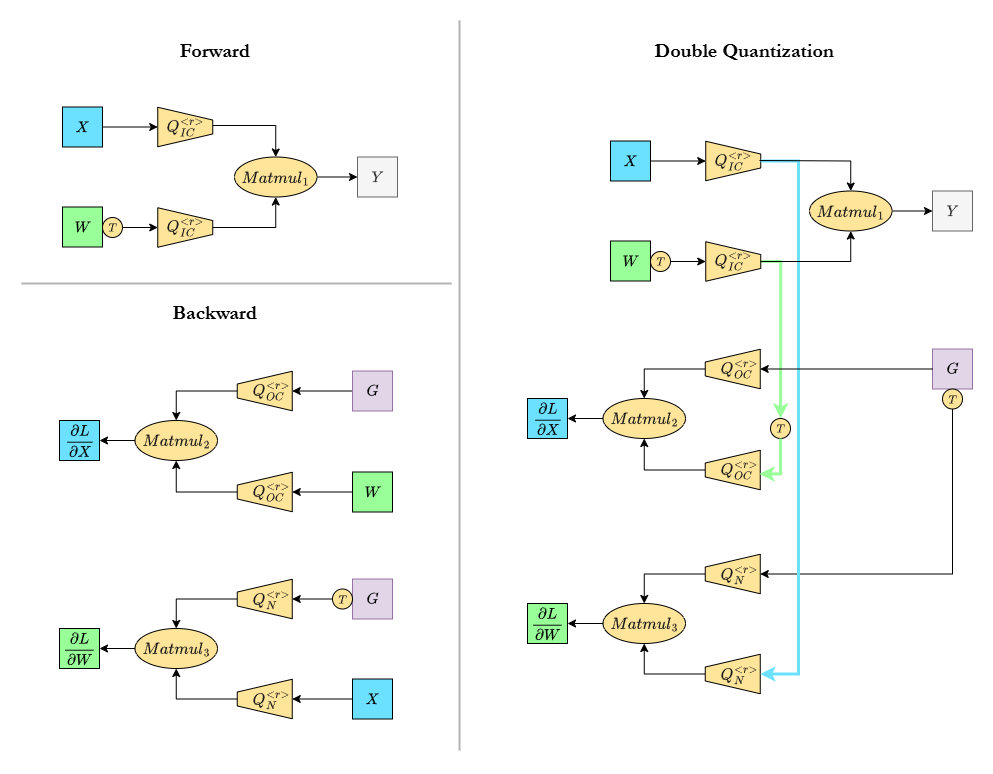

# fp4-trainkit

- A lightweight suite for quantized training in FP4 precision, supporting Microscaling MXFP4, NVIDIA NVFP4 formats.
- Integrates state of the art FP4 training research into recipes that explore scaler derivation, rounding choices, and fine grained control at the tensor level.
- Software simulation only for now; runs on standard GPUs.
- Why FP4? FP8 workflows are maturing with established tooling ([NVIDIA Transformer Engine](https://docs.nvidia.com/deeplearning/transformer-engine/user-guide/examples/fp8_primer.html), [TorchAO](https://github.com/pytorch/ao?tab=readme-ov-file#float8)), while FP4 is earlier stage research. A single, consistent suite helps rapid experimentation and fair comparisons across recipes.
> Status: Very new repository (less than 2 weeks old); interfaces and results are evolving.
---
### Updates 🔥
* 2025/07/28
    * Implemented quantized forward and backward pass of Linear layer, simulated in FP4 with configurable quantization parameters, covering recipes from recent FP4 training work: [`mx_baseline`][ocp_mx], [`nvidia_round_to_infinity`][nvda_mishra], [`tetrajet`][tetrajet], [`fp4_all_the_way`][fp4_all_the_way]. See [details](#supported-recipes-and-very-early-results) below.

    * Working? Preliminary Yes (limited validation). (1) Early results of training small ViT on MNIST. (2) Adapted official TetraJet implementation to use fp4-trainkit. See [here](https://github.com/vuiseng9/TetraJet-MXFP4Training/commit/f52ab93d07f783f5e2508817289f7a3504dd328a). Distributed Data Parallel (DDP) on multi-gpus is verified working. Training is in early epochs, the loss trajectory aligns with the official run, just a little slow at the moment due to plain PyTorch implementation while the official uses a Triton simulated kernel. Will share training outcomes later.
    
### Plan
🟠Now 🔵Next 🟣Later
* Expand test coverage for functional correctness and boundary cases.🟠
* Optimize performance of the FP4-simulated operations.🟠
* More recipes; verify and reproduce long horizon LLM FP4 training trends reported in recent papers. Targeting Huggingface environment.🔵
* Integrate native FP4 matmul on Blackwell or CDNA 4 GPUs (depends on HW availability & SW readiness).🔵
* Experiment with other tasks and architectures (FLUX, Whisper, MoE) 🟣
* Consider integrating with Megatron-LM locally for experiments🟣

---
### Getting Started
**Install**
```bash
git clone https://github.com/vuiseng9/fp4-trainkit && cd fp4-trainkit && pip install -e .
```

**Examples**
```bash
# FP32 Training a One-Block ViT on MNIST
python examples/fp32_train_ViTOneBlock_mnist.py

# FP4 Training using Microscaling Recipe (following the OCP spec)
python examples/fp4_train_ViTOneBlock_mnist.py --recipe mx_baseline
# --recipe {tetrajet, fp4_all_the_way, mx_baseline, nvidia_round_to_infinity}
```
See the delta.
```bash
diff --color fp32_train_ViTOneBlock_mnist.py fp4_train_ViTOneBlock_mnist.py
code --diff fp32_train_ViTOneBlock_mnist.py fp4_train_ViTOneBlock_mnist.py # visual diff in vscode
```
---
### Usage
1. Adapt existing training using a canned recipe. Two lines. 
    ```python
    from fp4tk import FP4LinearConverter, FP4_RECIPES
    # model = ...  # instantiate your model
    
    # Convert nn.Linear to FP4Linear when keywords match,
    # FP4Linear configuration will follow the recipe provided.
    # in-place design considering large model size these days.
    FP4LinearConverter().apply(
        model=model,
        recipe=FP4_RECIPES["tetrajet"],
        keywords=["qkv", "proj", "fc1", "fc2"]
    )  
    ```
    To illustrate, here is the minimal python.
    ```python
    import torch.nn as nn
    from fp4tk import FP4LinearConverter, FP4_RECIPES

    class OneLayer(nn.Module):
        def __init__(self):
            super(OneLayer, self).__init__()
            self.linear = nn.Linear(64, 128)
            self.relu = nn.ReLU()
        
        def forward(self, x):
            return self.relu(self.linear(x))

    model = OneLayer()

    print(model)
    print("_"*100)
    FP4LinearConverter().apply(model, recipe=FP4_RECIPES["mx_baseline"], keywords=['linear'])
    print(model)
    ```
    Notice the `FP4Linear` and its quantization configs.
    ```
    OneLayer(
      (linear): Linear(in_features=64, out_features=128, bias=True)
      (relu): ReLU()
    )
    ____________________________________________________________________________________________________
    OneLayer(
      (linear): FP4Linear(
        in_features=64, out_features=128, bias=True
        * FP4 Recipe          : MXFP4_Baseline
        * Double Quantization : False
          Q0( fwd_x          ): MXFP4Simulator(scale impl.: mx, RowWise blocking, Nearest rounding)
          Q1( fwd_wt         ): MXFP4Simulator(scale impl.: mx, ColWise blocking, Nearest rounding)
          Q2( bwd_grad_y     ): MXFP4Simulator(scale impl.: mx, RowWise blocking, Nearest rounding)
          Q3( bwd_w          ): MXFP4Simulator(scale impl.: mx, ColWise blocking, Nearest rounding)
          Q4( bwd_grad_yt    ): MXFP4Simulator(scale impl.: mx, RowWise blocking, Nearest rounding)
          Q5( bwd_x          ): MXFP4Simulator(scale impl.: mx, ColWise blocking, Nearest rounding)
      )
      (relu): ReLU()
    )
    ```
   
2. Customization - It depends on scope needed for a new recipe. To create a new recipe from existing building blocks, use `recipe.py` as a guide. It shows the expected structure and typical configuration patterns. Other precision formats and quantization tricks are likely to require extensions to `fp4tk/{quantizer/*, matmul.py, linear.py}`. Detailed customization guide will be provided in the future.

---
### Supported Recipes and Very Early Results
Check available canned recipes with `python -c "import fp4tk; print(list(fp4tk.FP4_RECIPES.keys()))"`

| Recipes                        | [mx_baseline][ocp_mx] | [nvidia_round_to_infinity][nvda_mishra]  | [tetrajet][tetrajet] | [fp4_all_the_way][fp4_all_the_way] | 
|:------------------------------ |:-------------:|:------------------:|:-----------------:|:-----------------:|
| Precision Format               | MXFP4         | MXFP4              | MXFP4             | **NVFP4**         |
| Block size                     | 32            | 32                 | 32                | 16                |
| Scale format                   | E8M0          | E8M0               | E8M0              | E4M3              |
| Scale impl                     | [eq.1](#eqmx) | [eq.2](#eqrtinf)   | [eq.2*](#eqrtinf) | [eq.3](#eqnvfp4)  |
| Double quantization            | No            | No                 | **Yes**           | No                |
| **Rounding**                   |               |                    |                   |                   |
| Forward, `Q(X)`                | `RTN`         | `RTN`              | `RTN`             | `RTN`             |
| Forward, `Q(Wᵀ)`               | `RTN`         | `RTN`              | `RTN`             | `RTN`             |
| Backward, `Q(grad_Y)`          | `RTN`         | `RTN`              | `SR `             | `SR `             |
| Backward, `Q(W)`               | `RTN`         | `RTN`              | `SR `             | `RTN`             |
| Backward, `Q(grad_Yᵀ)`         | `RTN`         | `RTN`              | `SR `             | `SR `             |
| Backward, `Q(X)`               | `RTN`         | `RTN`              | `SR `             | `SR `             |
| MNIST/ViTOneBlock (Top1%)**    | 93.50         | 93.45              | 92.78             | 75.68             |

* `RTN`: *round to nearest*; `SR`: *stochastic rounding*
* eq.1: <span id="eqmx"></span> $s = 2^{\lfloor \log_2 (\lvert x \rvert/ \lfloor \log_2 6 \rfloor) \rfloor}$
* eq.2: <span id="eqrtinf"></span> $s = 2^{\lceil \log_2 (\lvert x \rvert/ 6) \rceil}$
* eq.2*: other form of eq.2. see *truncation-free scaling* in [TetraJet][tetrajet] Section 3.2
* eq.3: <span id="eqnvfp4"></span> $s = cast_{e4m3}(\lvert x \rvert/ \log_2 6)$
* **: Early results from training a small one block ViT on MNIST using the example scripts (reproducible via `run_early_results.sh`). Tabulated values are the average over 5 runs. The FP32 baseline is 94.46%, above all FP4 training as expected. The weaker TetraJet result among MXFP4 is likely due to double quantization. The NVFP4 result is unexpectedly low even after learning rate tuning; With smaller block size 16, the required dynamic range is likely to be narrower than those for block size 32. Possible degradation factors include, limited scale range, the E4M3 scale precision vs E8M0, or an implementation issue. To debug. This is a tiny model and dataset, so treat the numbers as non‑representative. That said, the FP4 training runs end to end, currently [testing](https://github.com/vuiseng9/TetraJet-MXFP4Training/commit/f52ab93d07f783f5e2508817289f7a3504dd328a) with ImageNet-1K and ViT models. 
 
---
### Design

> $Q_{inner_dim}^{rounding}$ is FP4 quantizer configurable in blocking axis, rounding mode, as well as scale implementation (not shown). Simulated FP4 means output of $Q$ is dequantized back to FP32/BF16 for the matmul (not shown as well). 

The premise of low precision training is "*Speedups*" by mapping the heavy math in fewer bit representation where corresponding hardware runs faster. On FP4-supported HW, e.g. NVIDIA [Blackwell](https://nvdam.widen.net/s/wwnsxrhm2w/blackwell-datasheet-3384703) and AMD CDNA 4 ([MI350X](https://www.amd.com/content/dam/amd/en/documents/instinct-tech-docs/product-briefs/amd-instinct-mi350x-platform-brochure.pdf)), FP4 matmul peak throughput is about **2×** of FP8, **4×** over FP/BF16.

Most modern models are Transformers. The main workhorses are linear projections and attentions which are fundamentally matrix multiplications (matmuls). If we can execute these matmuls on the new FP4 units, we get speedups in training (inference too).

In practice, not all operations in transformer can be pushed to low precision. Optimizers, normalization, softmax, and others stay in higher precision for stability. Thus, most research and practioners target the linear layers first. In this repo, “**FP4 training**” means mapping the linear layer compute to FP4, while keeping the rest in FP32/BF16 as needed. Currently, we *simulate* FP4 on standard GPUs/CPUs using FP32/BF16 computation, so we can experiment without FP4 hardware.

There are 3 matmuls in Linear layer to map onto FP4, concretely:

* **MatMul 1** for computing forward pass of linear layer:
   
   &emsp; $Y = X W^{T}$ &emsp; where input $X$ is $(N, IC)$, weights $W$ is $(OC, IC)$ following `torch` layout, and output $Y$ is $(N, OC)$. For brevity, Transformer's batch size and sequence length are collapsed into $N$.

* **MatMul 2** in the backward pass for computing **gradient w.r.t. inputs** :

   &emsp; $\frac{\partial L}{\partial X} = \frac{\partial L}{\partial Y}\frac{\partial Y}{\partial X} =GW$ &emsp; where $G = \frac{\partial L}{\partial Y}$, is $(N, OC)$, the backprop incoming gradient. $\frac{\partial L}{\partial X}$ has shape of $(N, IC)$ 

* **MatMul 3** in the backward pass for computing **gradient w.r.t. weights**:

   &emsp; $\frac{\partial L}{\partial W} = \frac{\partial L}{\partial Y}\frac{\partial Y}{\partial W} =G^{T}X$ &emsp; where $\frac{\partial L}{\partial W}$ has the same shape as $W$, $(OC, IC)$


Essentially, $X, W, G$ must be quantized to FP4 before we feed them to the matrix engines. To minimize distortion, quantization is done block by block, i.e. groups of contiguous `K` elements within each channel. Microscaling (MXFP4) uses `K=32`, NVFP4 uses `K=16`. Per HW requirements, we quantize along the matmul contraction axis, the dimension that is multiplied and summed. E.g. matmul of `A @ B`, this means `A` is block quantized row wise and `B` is block quantized column wise.


Note that $W$ and $X$ appear in both forward and backward pass, but the required quantization axis flips between those matmuls. The simple approach is to keep an FP32/BF16 master copy and quantize separately for each pass. An alternative is double quantization: requantize an already‑(de)quantized tensor along the other axis. This repo supports both options, since both variants appear in prior work.

**Rounding.** We support two policies: `RTN` (round to nearest) and `SR` (stochastic rounding). `RTN` is fast, deterministic, and a good default, but round to nearest can introduce bias when quantizing gradients. Research has come up with `SR` quantization for backward pass, resulting in unbiased gradient and improves training stability. In our design, rounding is parameterized per quantizer to accommodate different choices: some recipes quantize only the backward path, others mix `RTN` in the forward path with `SR` on selected gradients.

The parameterization above manifests as `RecipeConfig` and `QuantConfig`. See `recipe.py` for canned recipes. e.g. , `mx_baseline` is configured as 
```
RecipeConfig(
	name                      = 'MXFP4_Baseline'
	quant_format              = <QuantFormat.MXFP4: 'mxfp4'>
	quant_fwd_matmul          = True
	fwd_x                     = QuantConfig(MXFP4, RowWise, Nearest Round, MX Scale Impl.)
	fwd_wt                    = QuantConfig(MXFP4, ColWise, Nearest Round, MX Scale Impl.)
	quant_bwd_grad_x_matmul   = True
	bwd_grad_y                = QuantConfig(MXFP4, RowWise, Nearest Round, MX Scale Impl.)
	bwd_w                     = QuantConfig(MXFP4, ColWise, Nearest Round, MX Scale Impl.)
	quant_bwd_grad_w_matmul   = True
	bwd_grad_yt               = QuantConfig(MXFP4, RowWise, Nearest Round, MX Scale Impl.)
	bwd_x                     = QuantConfig(MXFP4, ColWise, Nearest Round, MX Scale Impl.)
	double_quantization       = False
)
```

---
### References
*Dates are based on first appearance on arXiv*

**FP4 Research**
* [25/05/25][fp4_all_the_way], FP4 All the Way: Fully Quantized Training of LLMs
* [25/05/20](https://arxiv.org/abs/2505.14669), Quartet: Native FP4 Training Can Be Optimal for Large Language Models
* [25/03/04](https://arxiv.org/abs/2502.20586), Training LLMs with MXFP4
* [25/02/28][tetrajet], Oscillation-Reduced MXFP4 Training for Vision Transformers
* [25/01/28](https://arxiv.org/abs/2501.17116), Optimizing Large Language Model Training Using FP4 Quantization

**FP8 Research**
* [25/05/20][nvda_mishra], Recipes for Pre-training LLMs with MXFP8
* [22/09/12][fp8_formats], FP8 Formats for Deep Learning

**Other related**
* OCP [Microscaling Formats (MX)][ocp_mx] Specification
* [25/06/24, Nvidia's blog on NVFP4 Inference](https://developer.nvidia.com/blog/introducing-nvfp4-for-efficient-and-accurate-low-precision-inference)
* [25/06/04, Nvidia's blog on FP8 Training](https://developer.nvidia.com/blog/floating-point-8-an-introduction-to-efficient-lower-precision-ai-training/)
* [March GTC 2025, FP8 training on Blackwell with Transformer Engine](https://www.nvidia.com/en-us/on-demand/session/gtc25-s72778/)

[ocp_mx]: https://www.opencompute.org/documents/ocp-microscaling-formats-mx-v1-0-spec-final-pdf
[nvda_mishra]: http://arxiv.org/abs/2506.08027
[tetrajet]: https://arxiv.org/abs/2502.20853
[fp4_all_the_way]: https://arxiv.org/abs/2505.19115
[fp8_formats]: https://arxiv.org/abs/2209.05433